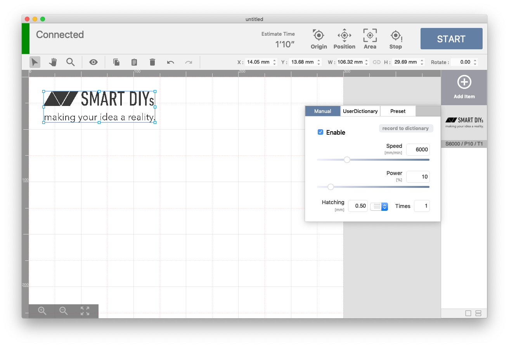

SmartDIYs Creator is software for laser processing, compatible with the FABOOL Laser series, Etcher Laser series and LC series. This is software that takes in image data, edits the layout, sets laser parameters, and performs processing.

---

## Product Specification
### Supported products
FABOOL Laser Mini / FABOOL Laser CO2 / FABOOL Laser DS / Etcher Laser / Etcher Laser Pro / LC950

### Supported files
png / jpg / bmp / gif / tif / svg / dxf (R12)

### Software operating requirements
#### Windows
- OS Windows 7 or later
- CPU Core i3 2.4Ghz or higher
- RAM：equal to or greater than 4GB
- HDD：free capacity equal to or more than 1GB

#### macOS
- OS 10.12.1 Sierra or later 
  ※ If you are using 10.11.6, please use [version 1.1.5 or earlier](https://manual.smartdiys.cc/smartdiys-creator-release-notes/).
- CPU：Core M 1.1Ghz or higher
- RAM：equal to or greater than 4GB
- HDD：free capacity equal to or more than 1GB

## Document Disclaimer
- Screen shots, etc. in this manual may differ from the actual display of the software.
- Contents may be updated without notice.
- Please note that we cannot accept any responsibility for detriment, lost profits, etc. due to the operation of this product.
- Microsoft Windows is either a registered trademark or trademark in the United States and / or other countries of Microsoft Corporation in the United States.
- Apple, App Store, Apple logo, Mac, Mac OS, OS X, macOS, iPad, iPhoto, iPod touch, and iTunes are trademarks of Apple Inc.
- Adobe, Adobe Illustrator and Photoshop are either a registered trademark or trademark in the United States and / or other countries of Adobe Systems Incorporated.
