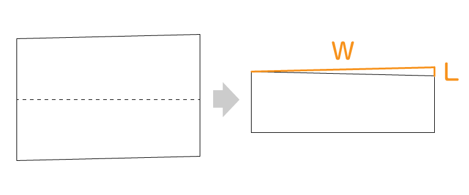

ここでは、ユーザ設定の「補正」項目について説明します。
この補正項目は下記の現象を改善するために有効な調整値です。

- 加工物の寸法がデータと異なる
- X軸とY軸が直角ではない

## 加工物の寸法がデータと異なる

### 主な原因
1. 光軸調整が適切ではない
2. プーリーやタイミングベルトなどの調整が適切ではない

上記の調整を行なっても改善しきれない場合は、大きさ補正の項目を設定して頂くことで改善が期待できます。

### 補正値の算出方法

1. 任意の幅・高さの矩形の加工データを用意します。
2. シワや歪みが生じにくい素材に刻印加工を行います。
3. データのサイズと刻印加工のサイズから比率を算出します。

#### [算出例]
データのサイズ: H:200.00mm x W:200.00mm  
実際の加工サイズ: H:199.10mm x W:199.50mm

[Hの補正値]

```
求め方: （データ）200.00 / （実際）199.10 = 1.00452034...
設定値: 100.45203(%)
```

[Wの補正値]

```
求め方: （データ）200.00 / （実際）199.50 = 1.00250626...
設定値: 100.25063(%)
```

## 直角のデータが正確ではない

### 主な原因

原因:
1. 光軸調整が適切ではない
2. フレームやX軸の組み立て時に傾きが生じている

上記の調整を行なっても改善しきれない場合は、傾き補正の項目を調整して頂くことで改善が期待できます。

### 補正値の算出方法

まず、上記の「大きさ補正」を済ませておくと、より正確に補正値が算出できます。

1. 任意の幅・高さの矩形の加工データを用意します。
2. シワのない紙などの素材を切断加工します。
3. 左下角と左上角が重なるように折り重ねます。
4. 右下角と右上角の重なりにズレがある場合、このズレの距離（L）を測ります。
5. 下記の公式に当てはめて、角度を算出します。  
`θ (deg) = arcsin ( (L/2) / W ) * 180 / π`

<p align="center">

</p>

#### [算出例]

データのサイズ: H:280.00mm x W:400.00mm  
折り重ねた際の右下角と右上角のズレ: L: 1.50mm

[角度の補正値]

```
求め方: arcsin( 0.75 / 400.00 ) * 180 / π
設定値:   
右上がりを補正する場合: -0.10743°  
右下がりを補正する場合: +0.10743°
```
