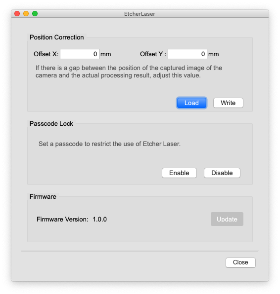
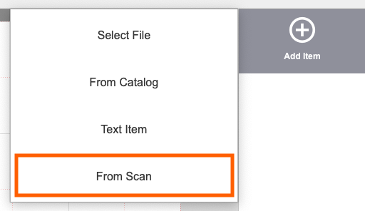
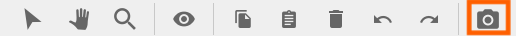

This section describes the functions for the Etcher Laser.

```
If you are using the Etcher Laser, make sure you have set the "Model Type" in the user settings to "Etcher Laser".
If the software and Etcher Laser are not connected, some functions will be disabled.
```

## Etcher Laser dialog

Go to the Menu bar, and click `Setting`> `EtcherLaser` to display the Etcher Laser dialog.

<p align="center">

</p>


### Position Correction
If there is a difference between the position of the captured image of the camera and the actual processing result, adjust this value.

### Passcode Lock
You can set a 4-digit passcode on the Etcher Laser to restrict its use.
The Etcher Laser with passcode cannot be operated without passcode authentication when connecting.
This function can be enabled/disabled.

### Firmware
You can update the firmware of the Etcher Laser.
If the update is possible, the button will be enabled.


## Scan

<p align="center">

</p>

Click the "From Scan" button to create an item scanned with the camera of the machine.  
You can select an original image (raster), fill (vector fill), or outline (vector stroke).  
Be careful not to block or obscure the camera markers.  
※ The button is disabled when the top cover is closed.


## Capture

<p align="center">

</p>

The processing area is captured with the camera of the machine and displayed on the canvas.  
Be careful not to cover the camera markers with any materials.  
※ A small amount of discrepancy may occur in the display position due to lens distortion.  
※ The button is disabled when the top cover is closed.

### Troubleshooting during capture

#### When the position is different
It is possible to reduce the position shift by setting the position correction value.

1. Open the Etcher Laser dialog.  
2. Enter the compensation value for each axis from the "Position compensation" item.  
  e.g.: If you want to move the actual machining position 1mm to the right and 0.5mm to the top -> X: 1mm / Y: -0.5mm  
3. Click the "Write" button to close the window.  

#### When the scale is different
If the scale of the preview image and the engraved result are different, the height input during capture may not be appropriate.
※ Capture images are scaled according to the height of the capture surface.
Enter the height from the work area to the capture surface.

#### When straight lines are distorted and captured
It may be caused by the distortion of the camera lens.  
When manufacturing a lens, it is difficult to make a perfect spherical surface, and slight irregularities may affect the capture result, resulting in a maximum deviation of 2 to 3 mm.  
Since this is an unavoidable problem in manufacturing, we appreciate your understanding.
