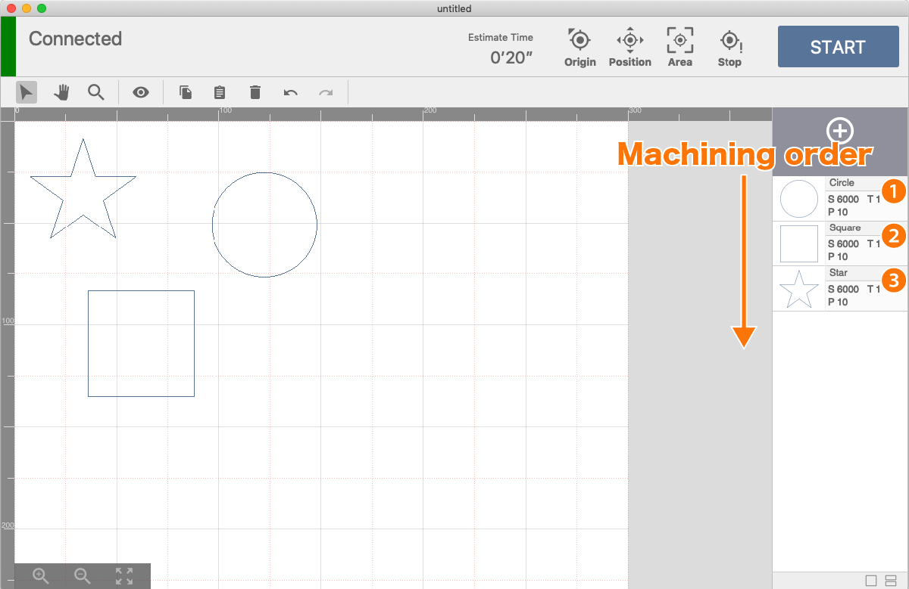
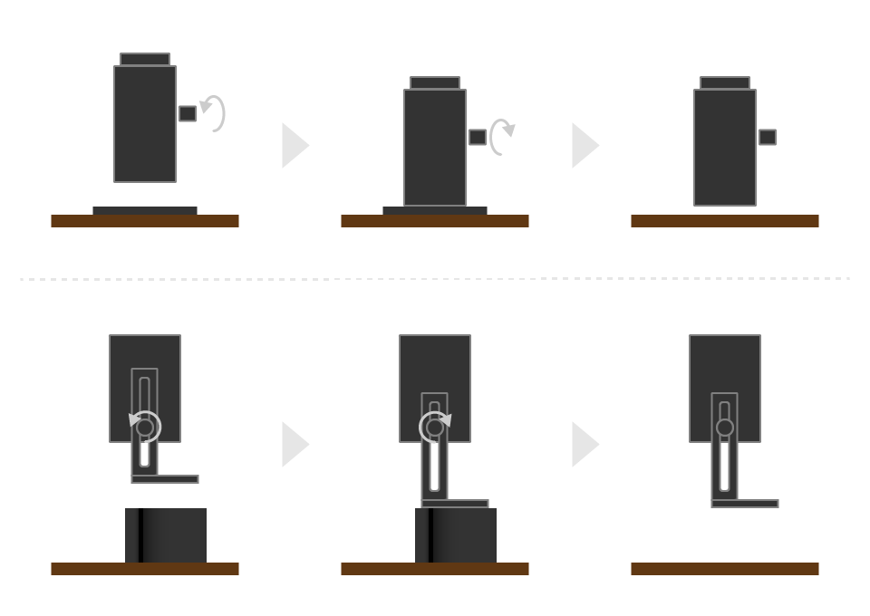

Here, we will actually start the software and explain the flow to processing.

## Software startup
Launch the installed software. When launched, a new project is deployed. At the first start, make sure that the type of machine to be used matches the type of machine set in the User Settings dialog.

## Connection with processing machine
Turn on the processing machine and connect the PC and the processing machine with the USB cable.

## Arrangement of processing data

### Data import
First, click the "Add Item" button in the Item List panel, and add a processing item by one of the following methods.

- `Import from local file`  
If you want to import your own image data (jpg / png / svg etc), please click "Select File" button. The file selection dialog opens, and you can import it by selecting the target file. You can also import by dragging and dropping the target file into the graphic area.

- `Import from asset catalog`  
Click "From Catalog" to use the figures and sample data provided in the software. The asset catalog will open and you can select and import your favorite data.

- `Create text item`  
Click the "Text Item" button to create a processing item of any character. You can create text items with your font. In addition, processing method can be selected from "painting only" "line only" "painting and line".  
※ We do not cope with vertical writing and line feed.

- `Scan (EtcherLaser only)`  
Click the "Scan" button to create an item scanned with the camera of machine.  You can select an original image (raster), fill (vector fill), or outline (vector stroke). Be careful not to block or obscure the camera markers.  
※ The button is disabled when the top cover is closed.

### Layout editing
Adding an item places a graphic object on the canvas. Set the position, size, and rotation angle of the placed object.

### Parameter settings
When you click the target item in the item list, the parameter setting window is displayed. Set the parameter in one of the following ways.

- `Manual`  
  You can set the processing parameters of the item manually. You can also register the set parameters in the user dictionary.

- `User Dictionary`  
  Apply the parameters registered in the user dictionary.

- `Preset`  
  It is a parameter prepared in advance. The processing result depends on the characteristics of the actually processing material and the adjustment accuracy of the machine.

### Processing order setting
When processing multiple items, it is processed in order from the top of the item list. The order of the item list can be rearranged by drag and drop.

## Preparation for processing

### Origin return
First, press the origin return button to perform origin return. By performing origin return, the processing machine can accurately grasp the position of the laser head.

### Material installation
The material to be processed is installed on the processing machine.

### Setting of focal length
Move the laser head directly above the material using the software's “position check mode” etc., and adjust the distance (focal length) between the material and the laser head.

### Confirmation of processing range
If necessary, please check the processing range for the material. Please use "Check Position" or "Check Area" to check the processing range.

## Processing start

---------------

### Safety check items

#### FABOOL Series
- Is the height of the laser head correctly adjusted?
- Are there any obstacles in the processing area or near the processing machine?
- Is the base under the material safe from burning?  
(Laser light may reach the base depending on the thickness of the material)
- Is the processing range completely over the material?

#### EtcherLaser
- Is the height of the laser head correctly adjusted?
- Are there any obstacles in the processing area or near the processing machine?
- Is the bottom plate closed properly?
- When processing with the bottom open, is the base under the material safe from burning?  
(Laser light may reach the base depending on the thickness of the material)
- Is the processing range completely over the material?

---------------

When everything is ready, click the START button. A reminder dialog will be displayed, check the contents and click the "OK" button.

Depending on the parameter settings and the material, it may burn with flame. Do not leave the processing machine while processing. In addition, the software always sends control information to the processing machine during processing. Therefore, if the PC goes into sleep mode or the application becomes inactive, sending of control information to the processing machine may be interrupted or the communication priority may be lowered. Please be careful.

## Finished processing
Take out the material from the processing machine and check the processing result.

## Work end
When all work has been completed, follow the steps below.

1. Disconnect the USB cable connecting the processing machine and the PC, and turn off the processing machine.
1. Save the project as needed. Information on current processing data and parameters can be saved as a project.
1. Close the software main window and exit the software.
