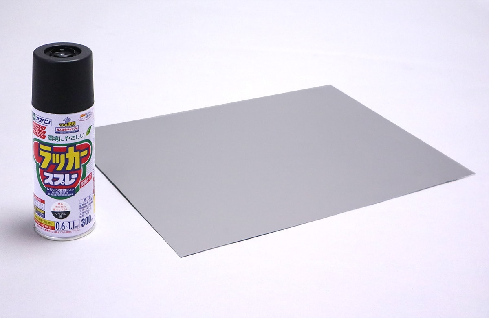
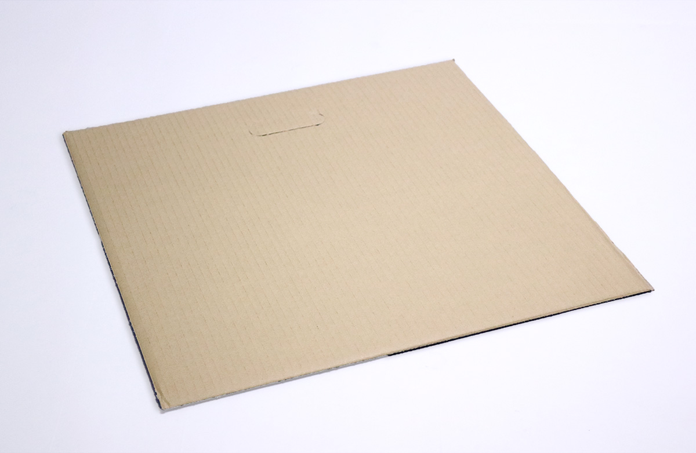
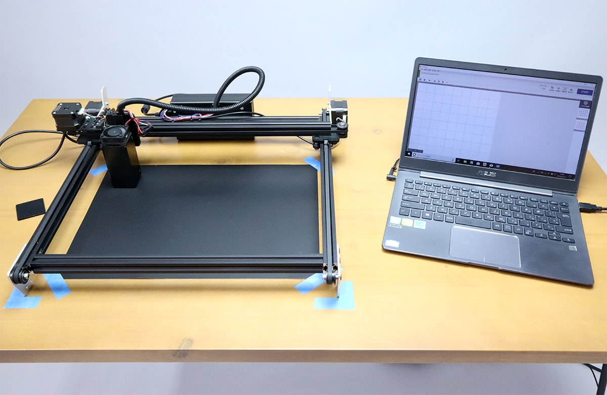
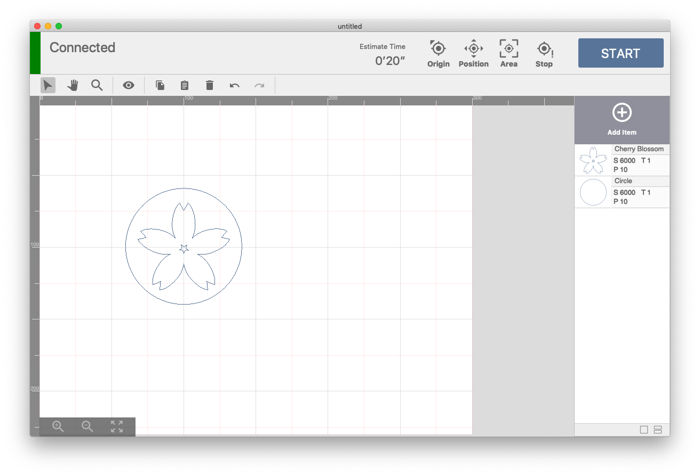
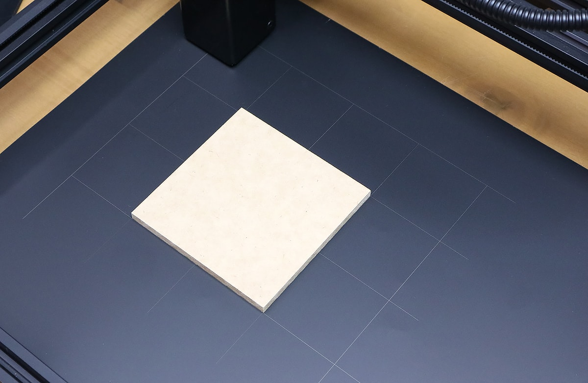
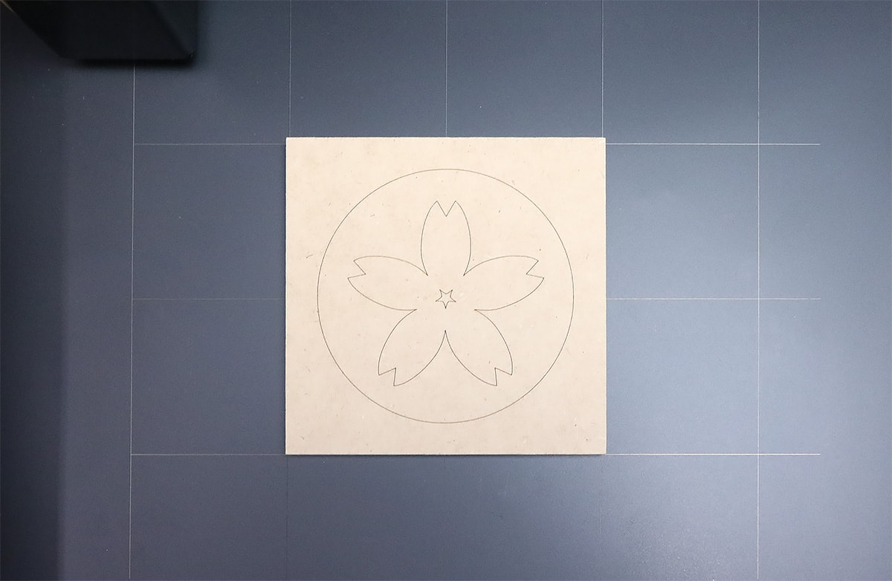
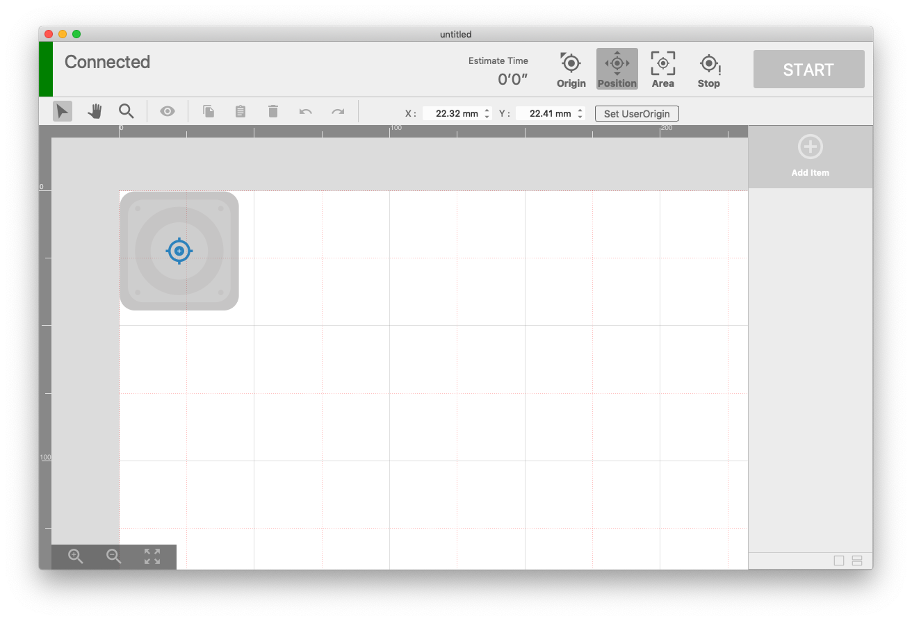
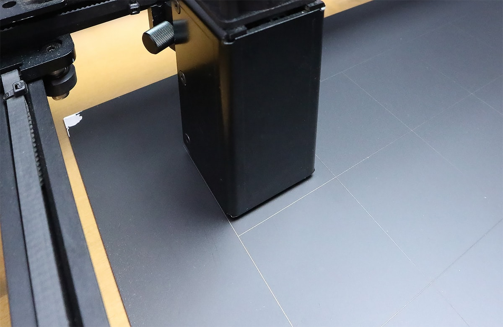
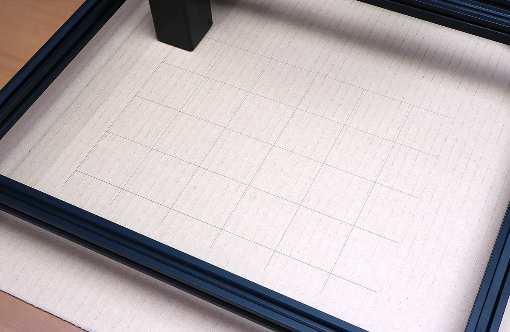

You can create a canvas grid as processing data by clicking "Processing Machine> Create Grid Item" in the menu bar. Engraving this grid on any base supports alignment.

```
※ Please be careful when using grids engraved on flammable materials.
```

|  |  |
|:-------------------------------------------------------------|:-----------------------------------------------------|
| Metal plate + lacquer-finished                                        | cardboard                                           |


## Engrave of grid item

<p align="center">

</p>


1. Fix the position of the base and the processing machine before engraving on the material to engrave the grid (hereinafter referred to as “base”). (If the positional relationship between the base and the processing machine deviates, the accuracy of positioning will be deteriorated).
1. Click "Processing Machine"> "Create Grid item" on the software to create a grid of any size.
1. Set parameters and process. There are major lines (black lines) and minor lines (red lines), but even main lines are fine.

## Positioning using grid
|  |  |
|:-------------------------------------------------|:-----------------------------------------|
| Position of object on canvas                 | Position of material to be processed                       |

<p align="center">

</p>


## When the relative position between the base and the processing machine has deviated
If the relative position between the base grid and the processing machine deviates, it can be restored to a certain extent by using the "Position check" function in the software.

1. Press the "Position check" button to move the laser head to the desired position (in the example below, the upper left of the head is set to the origin).
1. Check the positional relationship between the actual laser head position and the grid, and correct it to be the same as the positional relationship in the software.
1. Work 1 and 2 at several points to correct the relative position of the base and machine.

|  |  |
|:------------------------------------------------------|:----------------------------------------------|
| Positional relationship between laser head and grid on canvas        | Actual position relationship between laser head and grid        |

## Reference
FABOOL Laser Mini 1.6W

|  |  |
|:------------------------------------------------------|:----------------------------------------------|
| 金属板 + ラッカー塗装                                 | ダンボール                                    |
| S300 / P100 / T2                                      | S2000 / P100 / T1                             |
