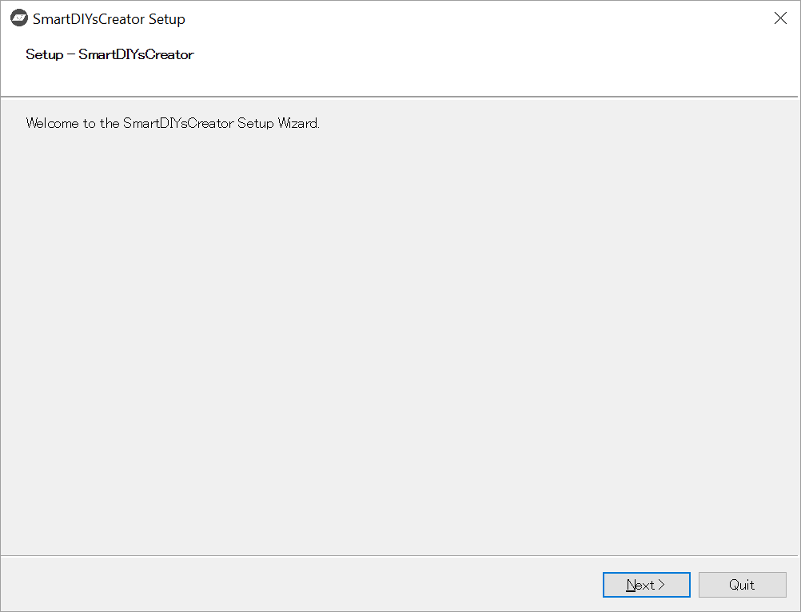
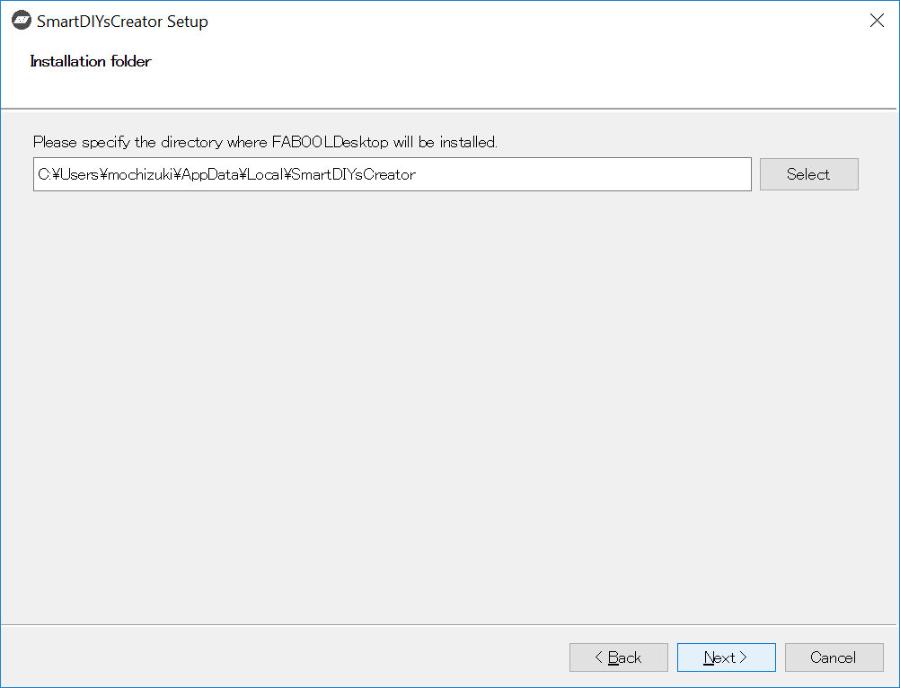
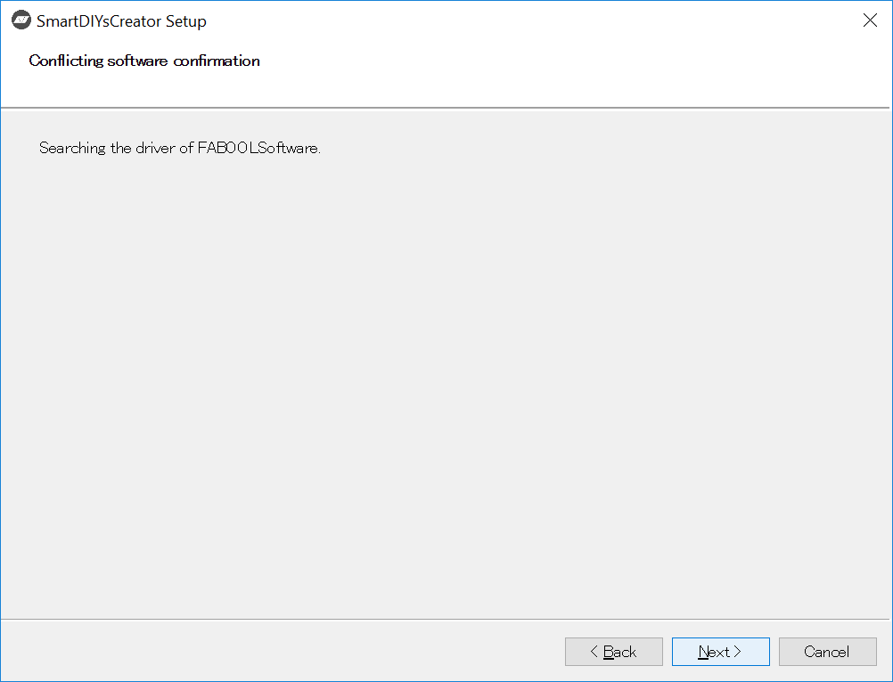
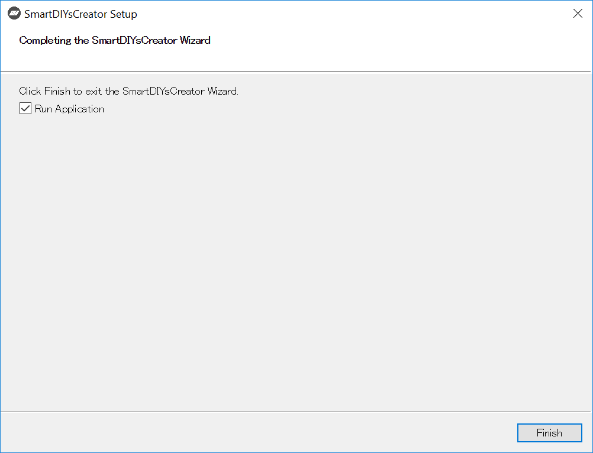

This section explains how to install SmartDIYs Creator.

If the old software driver (smartLaser driver / faboolLaser driver) is installed, it will be automatically deleted when this software is installed. Please be aware in advance.

## Software installation

1.Please check the terms of the agreement on <a href="https://www.smartdiys.com/smartdiys-creator/" target="_blank">this guide page</a> and download the installer for your operating system.

2.Run the downloaded installer.

3.The installation screen is displayed, and click the "Next" button.

4.Make sure that SmartDIYs Creator is already installed. If already installed, it will be uninstalled.

5.When the check is complete, click the "Next" button.

6.Specify the installation destination folder. If there are no changes, click the "Next" button.

7.Check the installation status of FABOOLSoftware driver. If it is installed, it will be uninstalled.   
※ It may take some time depending on the PC environment.

8.When the check is complete, click the "Next" button.

9.The components to be installed are displayed. Make sure that all items are checked, and click the "Next" button.

10.Confirm the displayed license terms, and if you agree, check "I accept the license" and click the "Next" button.   
※ If you do not agree with the license, you can not complete the installation.

11.Click the Install button to begin installation.

12.If you are using Windows, installation of device driver will start during installation, so click “Next” to install.

13.When the device driver installation is complete, click the "Finish" button.

14.The installation complete screen is displayed and click the "Finish" button. If "Run Application" is checked at this time, SmartDIYs Creator starts automatically.

## About setting of PC
SmartDIYs Creator constantly sends control information to the processing machine during processing. Therefore, if the PC goes into sleep mode or the application becomes inactive, sending of control information to the processing machine may be interrupted or the connection priority may be lowered. In order to avoid this, it is recommended to cancel the sleep setting referring to the following.

- [How to cancel the sleep setting（Windows 10）](https://www.tipsfound.com/windows10/03005)
- [How to cancel the sleep setting（Windows 7）](https://www.frontier-direct.jp/faq/09/004235.htm)
- [How to cancel the sleep setting（Mac）](http://minto.tech/mac-sleep/)
