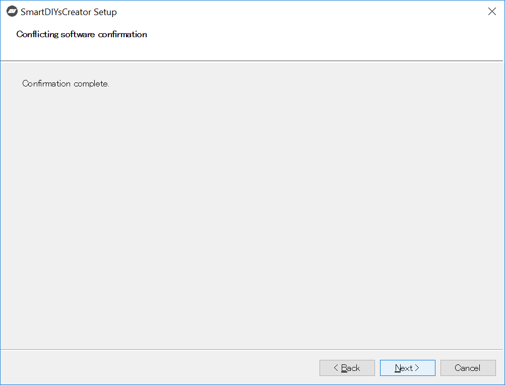
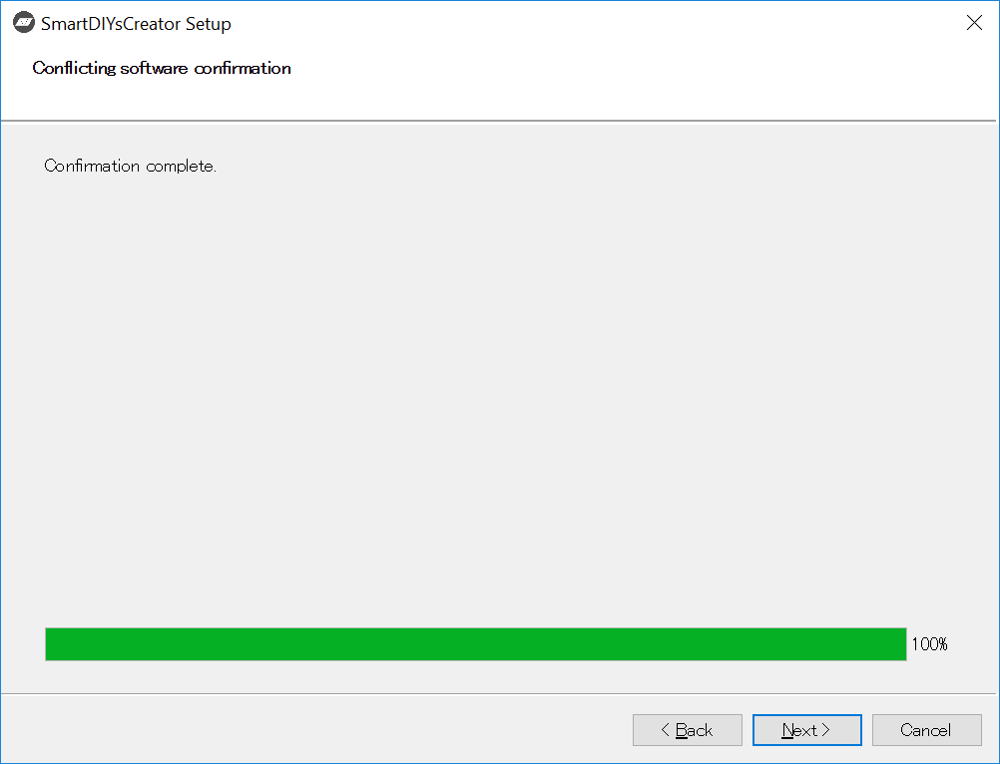
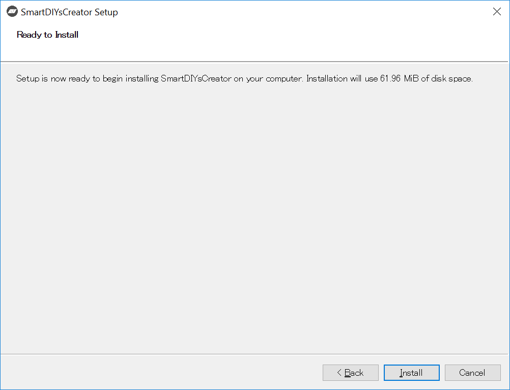
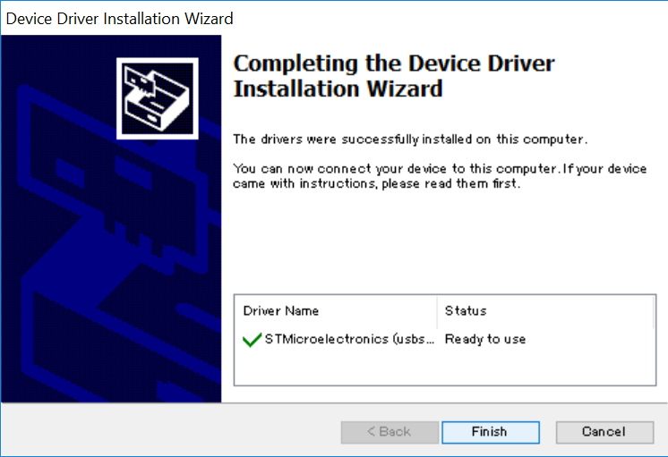

ここでは、SmartDIYs Creatorのインストール方法について説明します。

なお、旧ソフトウェアのドライバ（smartLaserドライバ/faboolLaserドライバ）がインストールされている場合は、本ソフトウェアのインストール時に自動的に削除されます。予めご了承下さい。

## ソフトウェアのインストール

1. <a href="https://www.smartdiys.com/smartdiys-creator/" target="_blank">こちら</a>のページから、お使いのOSのインストーラをダウンロードしてください。

2. ダウンロードしたインストーラを実行します。
3. Windowsをお使いの方でセキュリティ警告（SmartScreen）が表示される場合は、「詳細情報」をクリックし、発行元が「SMARTDIYS CO., Ltd.」であることを確認して「実行」ボタンを押してください。

---
4. インストール画面が表示されるので、「次へ」ボタンをクリックします。

---
5. SmartDIYs Creatorが既にインストールされているか確認します。既にインストールされている場合はアンインストールされます。

---
6. チェックが完了したら、「次へ」ボタンをクリックします。

---
7. インストール先フォルダを指定します。特に変更がなければそのまま「次へ」ボタンをクリックします。

---
8. FABOOLSoftwareドライバのインストール状況を確認します。インストールされている場合はアンインストールされます。※PC環境によっては少し時間がかかる場合があります。

---
9. チェックが完了したら、「次へ」ボタンをクリックします。

---
10. インストールするコンポーネントが表示されます。全てにチェックが入っていることを確認し、「次へ」ボタンをクリックします。

---
11. 表示されるライセンス条項をご確認頂き、同意される場合は「ライセンスに同意する」にチェックを入れ、「次へ」ボタンをクリックします。※ライセンスに同意されない場合はインストールを完了することはできません。

---
12. インストールボタンをクリックすると、インストールが始まります。

---
13. Windowsをお使いの場合、インストール中にデバイスドライバのインストールが開始されますので、「次へ」をクリックしてインストールを行います。

---
14. デバイスドライバのインストールが完了したら、「完了」ボタンをクリックします。

---
15. インストール完了画面が表示されるので、「完了」ボタンをクリックします。このとき「Run Application」にチェックが入っている場合は、自動的にDesktopAppが起動します。

## PCの設定について
SmartDIYs Creatorは加工中、加工機に対して常に制御情報を送付しています。そのため、PCがスリープモードになってしまったり、アプリケーションが非アクティブになってしまうなどすると、加工機への制御情報の送付が中断されてしまったり、通信の優先度が下げられてしまう場合があります。
これを避けるため、下記を参考にスリープ設定を解除することをお勧めしております。

- [スリープ設定の解除方法（Windows 10）](https://www.tipsfound.com/windows10/03005)
- [スリープ設定の解除方法（Windows 7）](https://www.frontier-direct.jp/faq/09/004235.htm)
- [スリープ設定の解除方法（Mac）](http://minto.tech/mac-sleep/)
