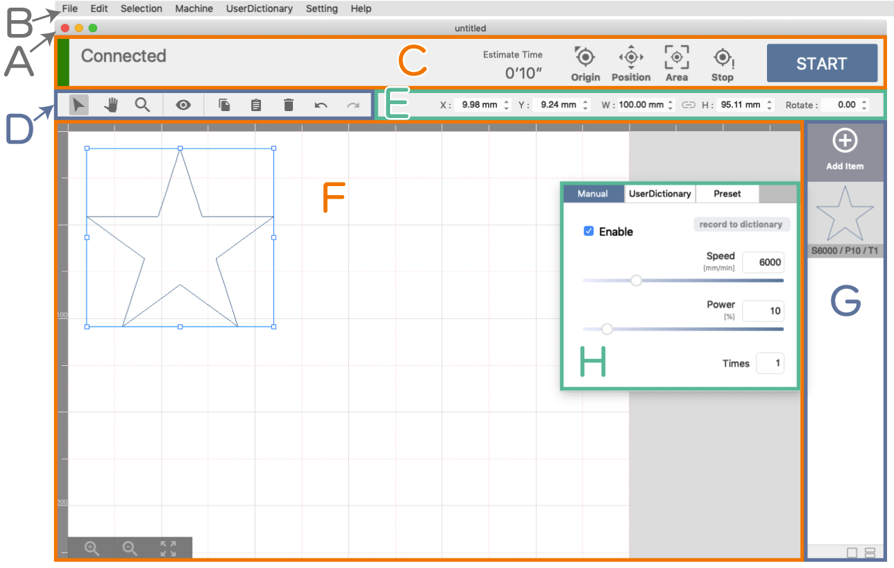
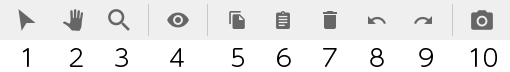
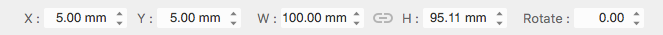
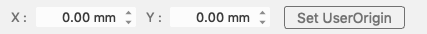
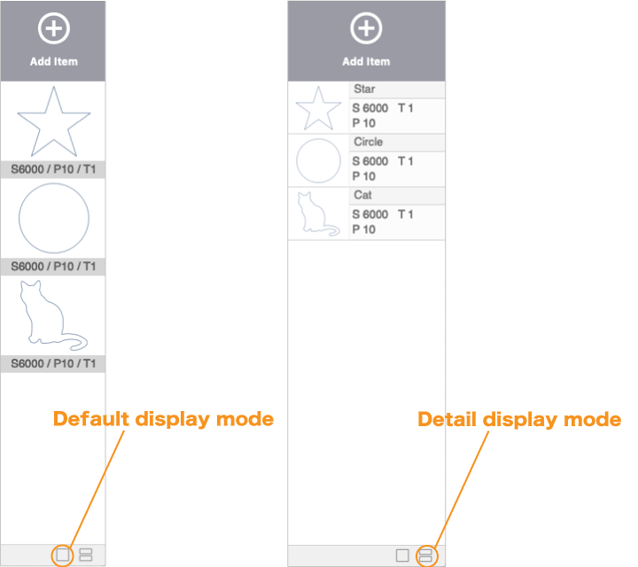

## ソフトウェア画面
本ソフトウェアの基本ウィンドウで、以下の要素から構成されています。

#### (A) タイトルバー
現在のプロジェクトファイルの名称や、最小・最大化ボタン、ソフトウェアの終了ボタンが配置されています。

#### (B) メニューバ
メニューを選択することにより、様々な機能を実行させます。

#### (C) 加工機コントロールエリア
加工機との接続状態やエラー内容が表示されます。また、加工機のコントロールは主にここから行います。

#### (D) ツールバー
グラフィックエリアのコントロールツールが表示されています。

#### (E) プロパティパレット
グラフィックエリアで選択しているアイテムの位置情報などが表示されます。

#### (F) グラフィックエリア
加工データのレイアウトを行うことができます。

#### (G) アイテムリスト
加工データを追加したり、加工データの一覧が表示されています。

#### (H) パラメータ設定ウィンドウ
アイテムリストに表示されているアイテムをクリックすると表示され、対象のアイテムの加工パラメータを設定します。

## メニューバー
### ファイル
- 新しいプロジェクト: 新規プロジェクトを作成します。
- プロジェクトを開く: 保存されているプロジェクトを開きます。
- プロジェクトを保存: 現在開いているプロジェクトを保存します。
- プロジェクトを別名で保存: 現在開いているプロジェクトを別名で保存します。

### 編集
- 元に戻す: プロジェクトの編集状態を1つ前の状態に戻します。
- やり直す: プロジェクトの編集状態を1つ後の状態に進めます。
- コピー: 選択しているグラフィックオブジェクトをペーストバッファにコピーします。
- ペースト: コピーしたグラフィックオブジェクトを貼り付けます。
- 削除: 選択しているアイテムを削除します。

### 選択
- 全て選択: グラフィックオブジェクトを全て選択します。

### 加工機
- 動作停止: 加工機の動作を停止させます。
- 原点復帰: 加工機に原点復帰指示を送ります。
- グリッドアイテムの作成: グラフィックエリアに表示されているグリッドを加工アイテムとして作成します。

### ユーザ辞書
- ユーザ辞書マネージャー: ユーザ辞書マネージャーを開きます。ユーザ辞書の編集やインポート・エクスポート等を行うことができます。

### 設定
- ユーザ設定: 各種設定を行うことができます。

### ヘルプ
- SmartDIYs Creatorについて: ソフトウェアのバージョン情報を確認できます。
- マニュアル: このマニュアルをブラウザで開きます。

## 加工機コントロールエリア

ここでは、加工機に関する情報や加工機への動作命令を行うことができます。
加工機との接続状態は「接続済み」「未接続」で表示されます。また、エラーがある場合はエラー内容も表示されます。

- 推定加工時間: 現在のプロジェクトのおおよその加工時間を `時間 : 分 ' 秒 ''` で表示します。
- 原点復帰: 加工機がレーザヘッドの原点位置を確認し、ヘッド位置の誤差を解消します。
- 位置確認: 位置確認モードへの切り替えを行います。このモードではグラフィックエリアにレーザヘッドのアイコンが表示され、オブジェクトの実際の加工位置を確認できます。位置確認モードを解除する場合はこのアイコンをもう一度クリックします。
- 範囲確認: 加工機のレーザヘッドが加工範囲を示します。
- 動作停止: 加工機の動作を停止させます。
- START: ボタンを押すと確認ダイアログが表示され、加工を開始します。

## ツールバー

- (1) 選択ツール: グラフィックエリア内のグラフィックオブジェクトをクリックすることで選択することができます。
- (2) パンツール: グラフィックエリアをドラッグすることで表示範囲の変更をすることができます。
- (3) ズームツール: グラフィックエリアをクリックすることで表示範囲を拡大することができます。また、Altキーを押しながらクリックすることで表示範囲を縮小することができます。ドラッグ操作では自由に拡大率変更を行うことができます。
- (4) プレビュー: 加工指示データを作成し、生成された加工指示データを可視化したものを表示します。
- (5) コピー: 選択しているグラフィックオブジェクトをペーストバッファにコピーします。
- (6) ペースト: コピーしたグラフィックオブジェクトを貼り付けます。
- (7) 削除: 選択しているアイテムを削除します。
- (8) 元に戻す: プロジェクトの編集状態を1つ前の状態に戻します。
- (9) やり直す: プロジェクトの編集状態を1つ後の状態に進めます。

## プロパティパレット
### グラフィックオブジェクト選択時

通常時は、グラフィックエリア内のグラフィックオブジェクトの座標情報等を表示、編集することができます。

- X: グラフィックオブジェクトのX座標を表示しています。この数値を変更することで座標を指定することができます。
- Y: グラフィックオブジェクトのY座標を表示しています。この数値を変更することで座標を指定することができます。
- W: グラフィックオブジェクトの幅を表示しています。この数値を変更することで幅を指定することができます。
- H: グラフィックオブジェクトの高さを表示しています。この数値を変更することで高さを指定することができます。
- 縦横非を固定: このモードでは、上記の操作で幅/高さを指定した際に、縦横非を固定するために高さ/幅が自動的に設定されます。このボタンクリックすることでモードの解除/設定を行うことができます。
- Rotate: グラフィックオブジェクトの回転を表示しています。この数値を変更することで回転を指定することができます。

### 位置確認モード時

位置確認モード時は、レーザヘッドの座標を表示、指定することができます。

- X: レーザヘッドのX座標を表示しています。この数値を変更することで座標位置に移動させることができます。
- Y: レーザヘッドのY座標を表示しています。この数値を変更することで座標位置に移動させることができます。
- ユーザ原点の設定: 現在の座標をユーザ原点として設定することができます。

## グラフィックエリア
加工データのレイアウトを行うためのエリアです。
- キャンバス: 加工機の加工範囲を表しています。加工範囲はユーザ設定で設定することができます。
- 拡大縮小ツール: グラフィックエリアの表示範囲を操作することができます。

## アイテムリスト
- アイテムを追加: クリックすることでメニューが表示され、プロジェクトにアイテムを追加することができます。
 - ファイル選択: ローカルファイルを追加します。
 - アセットカタログ: 本ソフトウェアに用意されている図形などを追加します。
 - テキスト作成: テキストオブジェクトを作成・追加します。

追加されたアイテムはリストから確認することができます。なお、このリストの並び順に加工が行われます。

また、アイテムリスト下部のアイコンをクリックすると表示モードを切り替えることができます。

#### パラメータ設定ウィンドウ
アイテムリストに表示されているアイテムをクリックすると表示され、対象のアイテムの加工パラメータを設定します。

- マニュアル: アイテムの加工の有効・無効やパラメータを手動で設定できます。また、設定したパラメータをユーザ辞書へ登録できます。
- ユーザ辞書: 登録したパラメータを選択できます。
- プリセット: 弊社で推定した加工パラメータです（加工結果は実際に加工する素材の特性や機械の調整精度に依存します）
