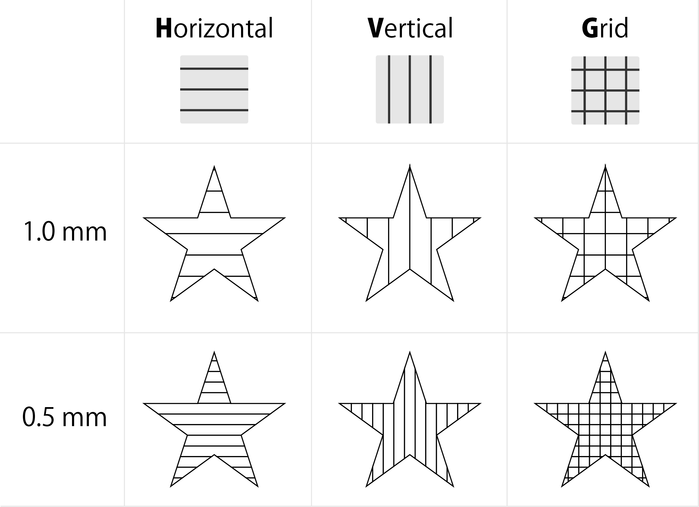

This section explains the parameter settings.

<p align="center">

</p>

## Effectiveness
You can set whether to process the target item. If "Enable" is unchecked, the item will not be processed.
```
※ Graphic objects for items that are unchecked for enabled have their click selection operations disabled.
※ You can select a group that contains invalid objects. You can also select with "Select all".
```

## Speed
Set the moving speed of the laser head for processing (laser irradiation). As the speed decreases, the energy of the laser used on the material increases.
```
※ It can be set in the range of 50-8000 [mm / min].
```

## Power
Set the intensity of laser irradiation. The greater the power, the greater the energy of the laser used on the material.
```
※ It can be set in the range of 0-100 [%].
```

## Number of times
Specify the number of times of laser processing. If a large amount of energy at one time adversely affects the material (melting or charring), repeated processing with a smaller amount of energy can improve the processing results.
```
※ It can be set in the range of 0-30 [times].
```

## DPI
This parameter is used for raster processing. Set the definition when performing processing (dithering) to express the tone of the image. By default, 254 DPI (dots per inch) is set, which is the value at which the laser is emitted every 0.1 mm. Also, unlike LCD etc., the size of the laser irradiation point itself does not change even if DPI is raised. Please be aware that if you raise the DPI too high the image will be burned too much.

```
※ You can set in the range of 72-300 [DPI].
※ All the images below are engraved with the same image data and the same processing size.
※ It can be set individually according to the material characteristics or processing time efficiency.
```

Imprinted cardboard with FABOOL Laser Mini 3.5W / Use image: 1023x778 pixels

<p align="center">

</p>


## Hatching
This parameter is used when processing a vector (painting) image. Hatching is a method of representing a surface by overlapping fine parallel lines, and is used to represent “filling” by laser processing. With hatching parameters, you can set the spacing between these parallel lines and the hatching pattern.
```
※ The interval can be set in the range of 0.05-3.0 [mm].
※ You can set 3 patterns of horizontal line (H: Horizontal), vertical line (V: Vertical) and grid (G: Grid).
※ Text painting processing is also treated as a vector (painting).
※ The impression of the processing result is different depending on the line width of the actual laser irradiation and the characteristics of the material.
```

<p align="center">

</p>
