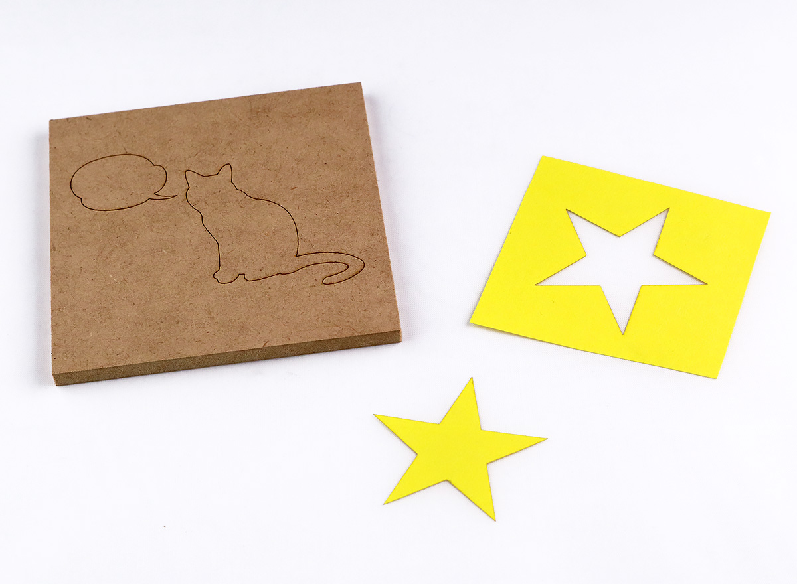
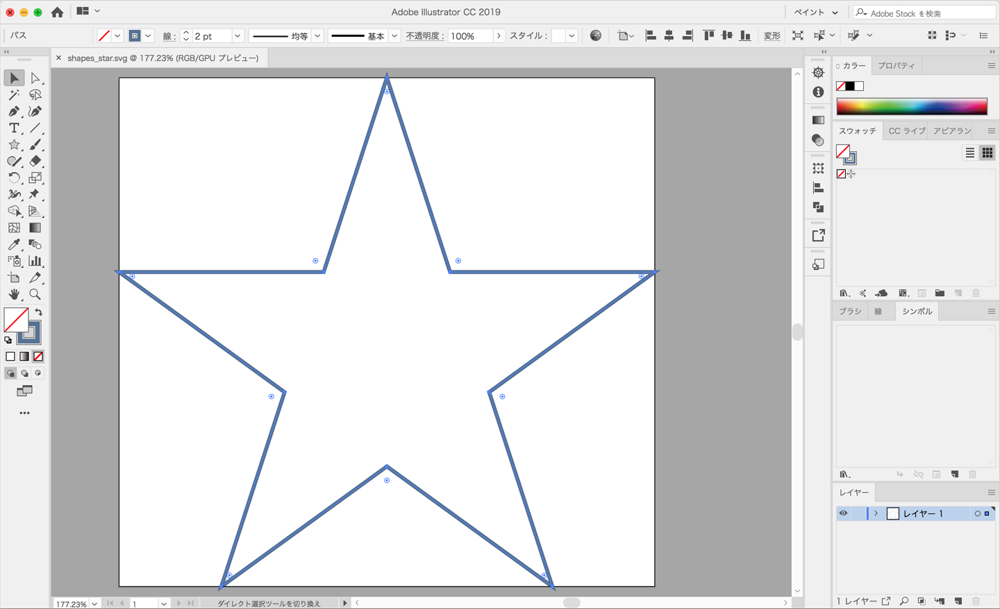
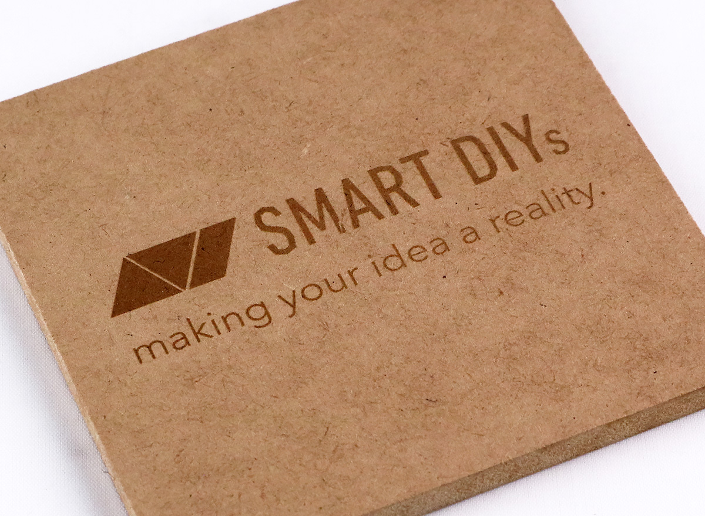
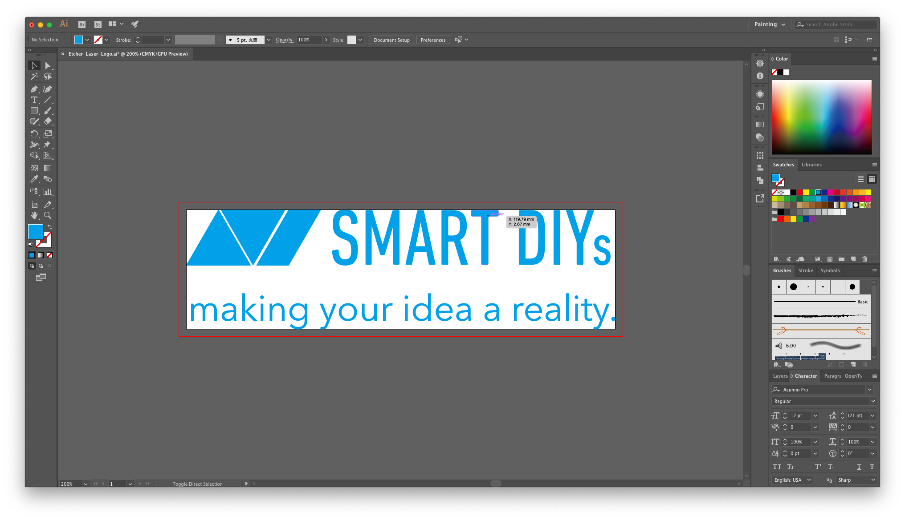
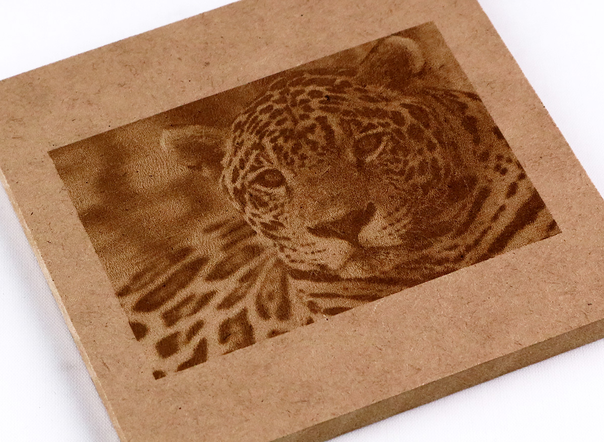
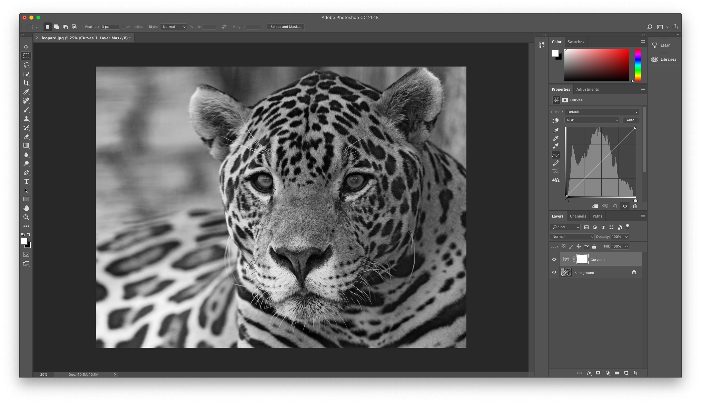

This section describes the types of laser processing in the FABOOL series and the corresponding image formats.

## Vector (line) processing

<p align="center">

</p>

In this processing method, the laser head can be moved along the vector image path to perform processing.

### Feature
- This processing method is suitable for cutting processing and marking of straight lines and curves.
- In order to perform this processing, vector images (SVG and DXF) are required.


### How to create data
You can create data for vector (line) processing by drawing an arbitrary figure with your drawing software and setting the line color.
Also, when importing SVG data into software, it is divided into separate items for each color. Therefore, it is possible to adjust the change of processing order by color-coding the lines beforehand.
```
※ White lines are ignored and should not be white.
```
<p align="center">

</p>


----------------------------------

## Vector (painting) processing

<p align="center">

</p>

In this processing method, the "painting" of the path is expressed by overlapping fine parallel lines (hatching). With this software, you can set the spacing and pattern of parallel lines.

### Feature
- This processing method is suitable for imprinting logos and characters.
- In order to perform this processing, vector images (SVG) are required.


### How to create data
You can draw arbitrary figures with your drawing software and set the painting color to create data for vector (paint) processing. Also, when importing SVG data into software, it is divided into separate items for each color. For this reason, it is possible to adjust the change in processing order by performing color coding in advance.
```
※ White paint is ignored and please specify other than white.
```
<p align="center">

</p>

```
[Document Disclaimer]
Even if you save JPG, PNG, etc. as SVG, they are not converted to vector images.
In order to convert to vector data, it is necessary to work on image tracing etc. with your drawing software.
```
----------------------------------

## Raster processing

<p align="center">

</p>

In this processing method, the gradation of the image is expressed in the raster image by performing the dithering process.

### Feature
- It is a processing method that is suitable for imprinting illustrations and photographs with contrasts.
- Raster images (JPG, PNG, etc.) are required to perform this processing.The density of dots is used to express light and shade rather than the intensity of the laser (the density of the imprint).


### How to create data
Please adjust the trimming and contrast with your paint software etc.

```
※ Automatically converted to grayscale when importing.
```

<p align="center">

</p>


----------------------------------
## About DXF data

### About export format
In this software, it is recommended to export DXF R12 text format.

### About color coding
The DXF format has many dialects for each software, and some software may not recognize the color even if it is exported by the above method. In that case, please export as SVG or use software or online service for converting SVG.

<p><a href="https://www.dxfconverter.org/" target="_blank">https://www.dxfconverter.org/</a></p>
<p><a href="https://convertio.co/dxf-svg/" target="_blank">https://convertio.co/dxf-svg/</a></p>
<p><a href="https://onlineconvertfree.com/convert-format/dxf-to-svg/" target="_blank">https://onlineconvertfree.com/convert-format/dxf-to-svg/</a></p>
