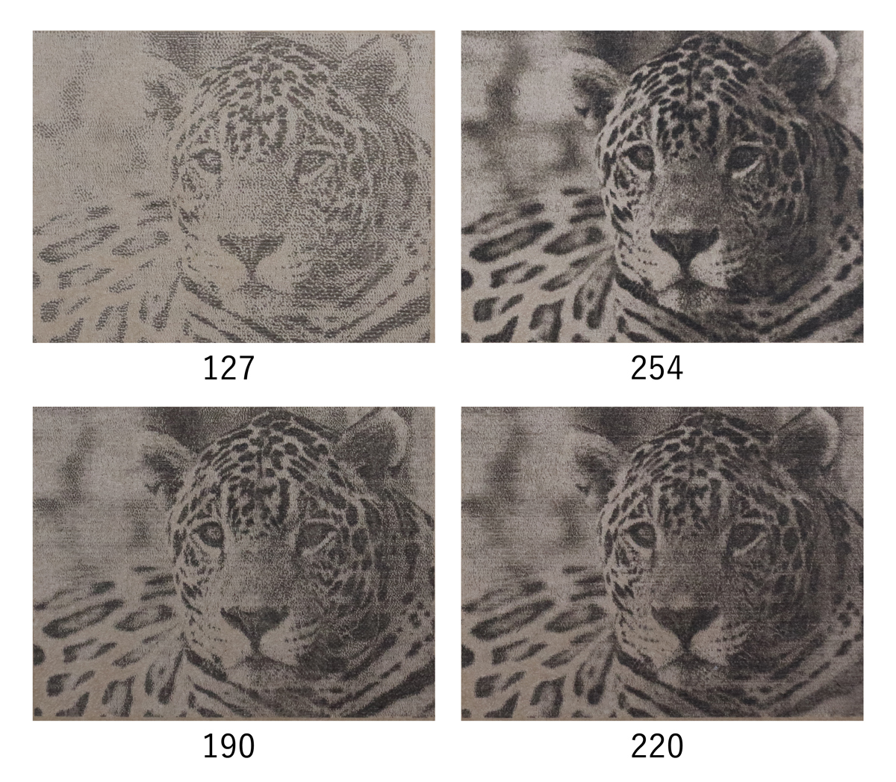

現行の ***FABOOL Desktop*** から変更された主な仕様についてご説明します。

## ラスタ画像の読み込みDPIを変更
これまでラスタ画像は読み込み時に90dpiとして読み込まれていましたが、これを254dpiに変更しました。この仕様変更は読み込み時にオブジェクトが配置される大きさにのみ影響し（小さく配置されます）、保持される画素数に対しては影響ありません。
ただし、FABOOL Desktop / SmartDIYs Creator 共に、x方向の解像度が1023ピクセルを超える場合、1023ピクセルにリサイズされてインポートされます。

## ラスタ画像の加工方法の変更
これまで画像の拡大縮小によって加工時の刻印密度（DPI）が変化し、加工結果に影響を与える仕様になっていましたが、拡大縮小に関わらず、加工時のDPIを一定に保つよう仕様を変更しました。
「加工時のDPI」とは読み込まれた画像データをどの程度の解像度でレーザ照射するかを表現しています。言い換えると、グレースケール画像に対しディザリング処理を行う際の解像度になります。
ただし、現在のファームウェアの制約によりx方向の最大ドット数は1023になるため、これを超える場合はx方向にスケールして表現されます。
また、DPIによってY方向の走査間隔も変化するため、DPIを下げて加工することで加工時間を短縮することも可能です。

```
※下記の画像は全て同じ画像データ及び同じ加工サイズで刻印しております。
※素材の特性や加工時間効率などに応じて個別に設定頂けます。
※FABOOL Laser Mini 3.5W でダンボールに刻印 / 使用画像 : 1023×778 ピクセル
```

<p align="center">

</p>

## SVG読み込み時の解釈を一部変更
これまで「塗り」のみで作られたFillデータには自動的に線が付加されていましたが、この仕様を変更し、自動的に線を付加されないようにいたしました。この仕様変更は概念の複雑化を防ぐことを目的としております。この仕様変更により、同じSVGデータでもFABOOL Desktopと比べインポート結果に差異が生じる場合があります。

## FILL加工時の最適化を変更
Fillオブジェクト加工時の経路最適化（最短経路）の適用をやめ、ラスタ同様Y軸方向に順次加工していく仕様になりました。このため、一部データでは加工時間が増加する可能性がありますが、ハードウェアの調整不足による軸滑りなどのリスクが少なくなります。

## コピー＆ペースト時の挙動変更
これまでオブジェクトのコピー＆ペーストを行なった際、パラメータ設定項目も複製されるため、数値の変更作業が煩雑になっておりました。今回の仕様の変更により、コピー＆ペーストしたオブジェクトは同じパラメータを共有するようになります。
従来通り別のパラメータを設定したい場合は、画像ファイル等を再度インポートして下さい。

そのほか細かな操作方法の違いはありますが、基本的な考え方は現行のFABOOL Desktopと変わりません。
