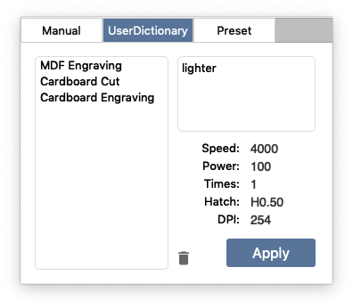
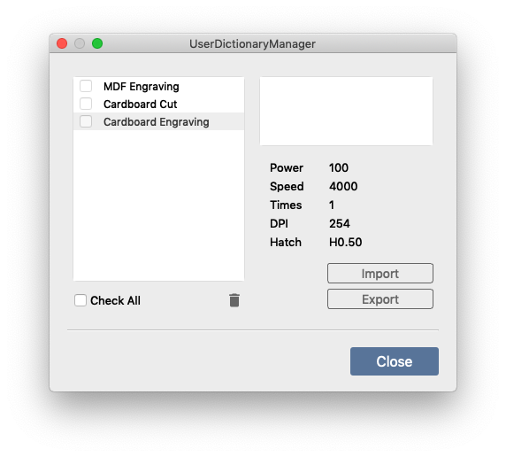

ここでは、ユーザ辞書の活用方法について説明します。

<p align="center">

</p>

## ユーザ辞書の活用

よく使うパラメータをユーザ辞書へ登録しておくとパラメータ設定が簡単になります。
また、登録後の編集やインポート・エクスポート機能も備えています。

### ユーザ辞書への登録

ユーザ辞書への登録は下記の手順で行います。
1. パラメータ設定ウィンドウの「マニュアル」タブを開きます。
2. 任意のパラメータを設定します。すでに設定済みの場合はスキップしてください。
3. 「辞書へ登録」ボタンをクリックすると、パラメータ編集ダイアログが表示されます。
4. パラメータの名称と、必要に応じて説明文を入力します。
5. OKボタンを押すと、ユーザ辞書に登録されます。

### ユーザ辞書の利用
ユーザ辞書を利用するには、下記の操作を行います。
1. パラメータ設定ウィンドウの「ユーザ辞書」タブを開きます。
2. 任意のパラメータをクリックし、パラメータの設定値を確認します。
3. 適用ボタンをクリックします。

### ユーザ辞書に登録されたパラメータの編集
1. パラメータ設定ウィンドウの「ユーザ辞書」タブを開きます。
2. 対象のパラメータをダブルクリックすると、パラメータ編集ダイアログが表示されます。
3. 各設定値に任意の値を入力します。
4. OKボタンを押すと、パラメータの編集が完了します。


## ユーザ辞書マネージャ

<p align="center">

</p>


メニューバーの [パラメータ] > [ユーザ辞書マネージャー] を選択すると、ユーザ辞書マネージャーダイアログが表示されます。
ここでは、ユーザ辞書のインポートやエクスポート、一括削除の操作が行えます。

### ユーザ辞書のエクスポート
1. エクスポートボタンを押してエクスポートダイアログを表示します。
2. 表示されているリストからエクスポートするパラメータにチェックを入れます。
3. OKボタンを押して、保存場所および保存ファイル名を指定します。

### ユーザ辞書のインポート
1. インポートボタンを押してファイル選択ダイアログを表示します。
2. インポートしたいユーザ辞書ファイルを選択すると、インポートダイアログが表示されます。
3. インポートしたいパラメータを選択して、OKボタンを押します。

### パラメータの一括削除
1. 表示されているリストから削除したいパラメータにチェックを入れます。
2. ゴミ箱アイコンをクリックし、削除を行います。

```
※削除されたアイテムは復元できません。事前にエクスポート等でバックアップを作成することをお勧めいたします。
```
