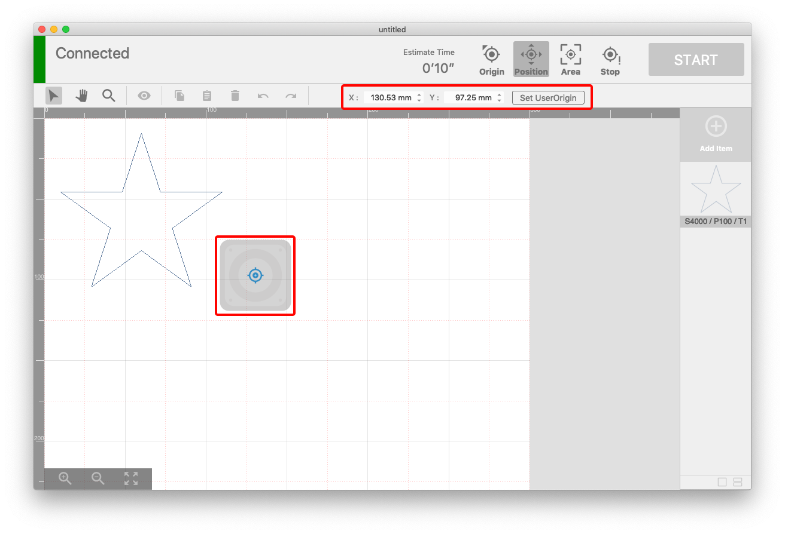
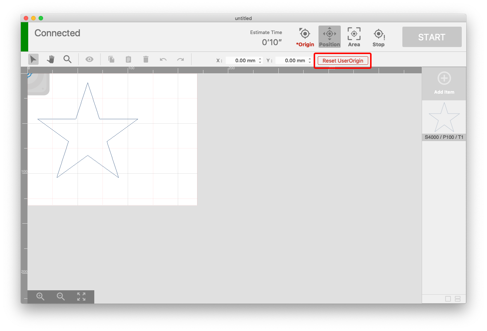

This section explains how to set the user origin.

## Overview of setting user origin

By setting the user origin, the origin set near the normal limit switch can be set to the user's arbitrary coordinates. If this setting is made, origin return to the machine origin is not performed at the start of machining.

### Usage scene of this function
- When there is height in the edge of the material such as a flat plate or tray, and it is hit when performing origin return
- When you do not want to perform origin return at the start of processing due to alignment or other reasons

### Application consideration for this function
- Origin return is an operation required for the processing machine to accurately know the position of the laser head.
- In the user origin mode, since the origin return to the machine origin is not performed, accident errors may be accumulated in the position of the laser head. **※ It depends on the adjustment state of the machine such as shaft slip and hook**.
- If the accident error becomes large, it may touch the limit switch etc. and **the processing may stop**.
- If an axis shift occurs, cancel this mode and perform origin return.

## How to set user origin
- Perform origin return.
- Click the position check button to switch to position check mode.
- Move the laser head to any position or enter a numerical number.
- Click the "Set UserOrigin" button.

## How to cancel user origin
- Click the position check button to switch to position check mode.
- Click the "Reset UserOrigin" button.

